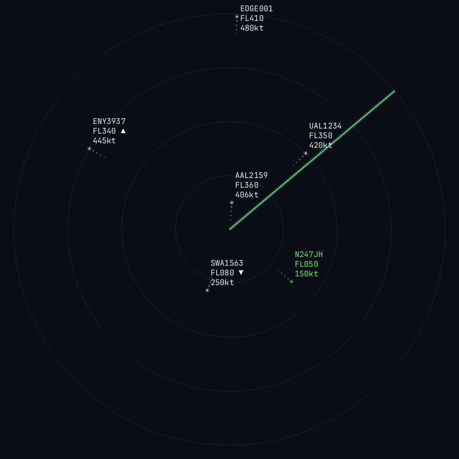

# flyover

[](https://github.com/linuxbren/flyover/actions/workflows/ci.yml)
[](https://crates.io/crates/flyover)
[](LICENSE)

A real-time ADS-B radar scope, in your terminal.



`flyover` pulls live aircraft positions from [adsb.lol](https://adsb.lol) for
wherever you are and renders them as an old-school radar scope — range rings,
a rotating sweep, fading comet trails, and per-contact data tags (callsign,
altitude, groundspeed, climb/descend). Built for [Omarchy](https://omarchy.org)
specifically: it reads your live Omarchy theme colors so the scope always
matches whatever theme you're running, and ships with an optional bar widget
that shows an ambient aircraft count and launches the scope on click.

## Two render modes

- **Sixel** (default) — an off-screen rasterizer (anti-aliased circles/lines,
  soft phosphor glow) displayed via the Sixel graphics protocol. Real CRT
  look, but per-frame cost depends heavily on your terminal's own Sixel
  decoder — some terminals render this buttery smooth, others less so.
- **Braille** — the original character-based renderer (no image encoding at
  all), animates smoothly everywhere, more of a classic "ASCII radar" look.

Press `v` any time to switch between them.

## Requirements

- A Rust toolchain (to build)
- A terminal that supports Sixel graphics for the default mode (confirmed
  working in [foot](https://codeberg.org/dnkl/foot); braille mode works in
  any terminal regardless)
- Best experience on [Omarchy](https://omarchy.org) — live theme sync and the
  bar widget are Omarchy-specific. The scope itself still runs anywhere with
  a fontconfig `monospace` alias (falls back to a classic CRT-green palette
  off Omarchy) and a set location (see below).

## Install

The pill (see below) checks `PATH` first, so `cargo install` is the
easiest way to get set up:

```
cargo install flyover
```

## Build from source

```
git clone https://github.com/linuxbren/flyover.git
cd flyover
cargo build --release
```

Always use `--release`. Sixel encoding is real per-frame work; a debug build
is noticeably choppier (the app warns about this on startup if it detects one).

## Location

flyover reads its center point from
`~/.local/state/omarchy/settings/weather.json` (the same file Omarchy's
Weather widget uses), so if you've already set a weather location you're set:

```
omarchy-weather-location --set "Your City" <lat,lon>
```

Without Omarchy installed, create that file by hand with
`{"name": "...", "latitude": ..., "longitude": ...}`.

## Run

```
cargo run --release
```

| Key | Action |
|---|---|
| `q` / `Esc` | quit |
| `+` / `-` / arrow up/down | zoom in/out (5–100nm) |
| `0` | reset zoom |
| `v` | toggle Sixel / braille render mode |

## Bar widget (Omarchy)

A companion widget — an ambient aircraft-count pill for the bar that
launches (or focuses) the scope on click — lives in its own repo,
[flyover-pill](https://github.com/linuxbren/flyover-pill), so it installs the
normal Omarchy way:

```
omarchy plugin add https://github.com/linuxbren/flyover-pill.git --enable
omarchy bar put bren.flyover --section right
```

It resolves the `flyover` binary via `PATH` first, falling back to
`$HOME/flyover/target/release/flyover` — so it works whether you've
`cargo install`ed it or just built it in place.

## Screensaver (experimental)

Omarchy's built-in screensaver already animates the plain text in
`~/.config/omarchy/branding/screensaver.txt` (via `ttfx`, re-reading the
file fresh each effect cycle) — so `flyover --ascii-snapshot [path]` renders
one static plain-ASCII frame of the current scope (rings, contacts, data
tags; no color or trails, since `ttfx` recolors per-effect regardless and a
one-shot process has no history to fade from) to that file, or wherever you
point it. Wire it to a timer of your choosing and Omarchy's own screensaver
does the rest:

```
flyover --ascii-snapshot ~/.config/omarchy/branding/screensaver.txt
```

## Dev tools

- `flyover --preview <path>.png` — renders a synthetic scene straight to a
  PNG, bypassing the terminal and network entirely. Useful for checking the
  raster output without a live TTY.
- `flyover --bench` — times the raster + Sixel-encode pipeline (both render
  modes) against an in-memory backend, to diagnose per-frame cost.

## License

MIT — see [LICENSE](LICENSE).
